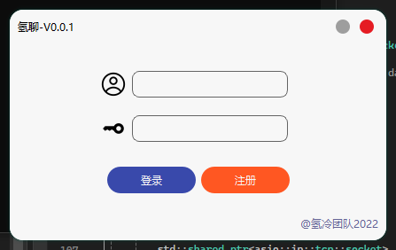

# QingLiaoChatClient 氢聊客户端
这是一个氢聊聊天软件项目

## 目前进度
登录注册，网络模式构建  


## 前置

### 最基本的要求
1. [git](https://git-scm.com/)
2. llvm或者gcc或者msvc等c++编译器
3. [cmake](https://cmake.org/)
4. [vcpkg](https://github.com/microsoft/vcpkg)

### 构建 QingLiao Chat Server
```cmd
vcpkg install kcp
vcpkg install openssl
vcpkg install asio
vcpkg install cpp-httplib
vcpkg install websocketpp

cmake -B build -S . -DCMAKE_TOOLCHAIN_FILE=你的vcpkg目录/scripts/buildsystems/vcpkg.cmake -DCMAKE_PREFIX_PATH=你的Qt构建目录
cd build
cmake --build . --config Release -j8
```

## 开发规则
1. 必须使用驼峰法命名
2. 必须保证线程安全，在多线程环境下必须使用线程锁 (std::mutex, std::shared_mutex)
3. 必须保证内存安全，尽量使用std::shared_ptr等代理
4. 必须保证无死锁情况发生
5. 未经过测试或者不成熟的技术请勿在项目中直接使用

## TODO
- [x] Network
- [x] Manager
- [x] User
- [ ] Room (Private Room and Group Room)
- [ ] Voice Chat
- [ ] File Transport
- [ ] Permission
- [ ] Chat Bot Library
